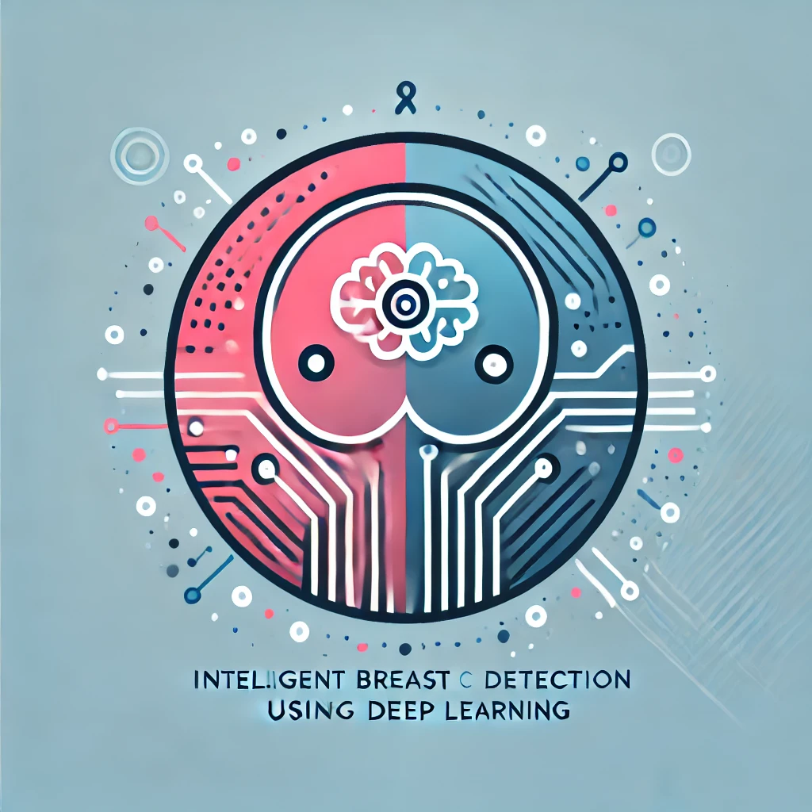

# MammoVision: Detección Inteligente de Cáncer de Mama mediante Deep Learning

<div align="center">
  
  <br>
  <p>
    <a href="#descripción">Descripción</a> •
    <a href="#características">Características</a> •
    <a href="#instalación">Instalación</a> •
    <a href="#uso">Uso</a> •
    <a href="#tecnologías">Tecnologías</a> •
    <a href="#equipo">Equipo</a>
  </p>
</div>

## 🏫 Institución

**Universidad Autónoma Gabriel René Moreno**  
Facultad de Ingeniería en Ciencias de la Computación y Telecomunicaciones (FICCT)  
Feria Facultativa de Proyectos de Investigación  
Gestión 2-2024

## 📋 Descripción

MammoVision es un sistema de detección inteligente que utiliza YOLOv11-seg para identificar y segmentar lesiones mamarias. El backend proporciona una API robusta para el procesamiento de imágenes mamográficas y la generación de predicciones precisas.

### 🎯 Objetivos

- Procesamiento eficiente de imágenes mamográficas
- API REST para integración con frontend
- Optimización de inferencias con GPU
- Gestión de múltiples formatos de imagen

## ✨ Características

- **Procesamiento Rápido**: Análisis optimizado con CUDA
- **API RESTful**: Endpoints documentados con Swagger
- **Segmentación Precisa**: YOLOv11-seg para detección exacta
- **Cache Inteligente**: Optimización de recursos y respuestas
- **Validación Robusta**: Verificación de formatos y calidad

## 🚀 Instalación

### Prerrequisitos


```bash
Python 3.10 o superior
CUDA 12.6 (para GPU)
```


### Configuración del Entorno

1. Clonar el repositorio:


```bash
git clone https://github.com/sm-nunez404/mammovision.git
cd mammovision/mammovision-backend
```

2. Crear y activar entorno virtual::


```bash
python -m venv venv
source venv/bin/activate # En Windows: venv\Scripts\activate
```


3. Instalar dependencias:


```bash
pip install -r requirements.txt
```


## 💻 Uso

1. Iniciar el servidor:


```bash
python app.py
```

El servidor estará disponible en `http://localhost:10000`

### Endpoints Principales

- `POST /api/predict`: Análisis de imagen mamográfica
- `GET /api/health`: Estado del servidor
- `GET /api/docs`: Documentación Swagger

## 🛠️ Tecnologías

- **Framework**: Flask
- **ML/DL**: PyTorch, YOLOv11-seg
- **Procesamiento**: OpenCV, NumPy
- **GPU**: CUDA 12.6
- **Documentación**: Swagger/OpenAPI

## 📊 Métricas de Rendimiento

### Modelo YOLOv11-seg
- mAP@50: 0.485
- mAP@[50:95]: 0.315
- Precisión (Maligno): 0.545
- Recall (Maligno): 0.571

### Rendimiento API
- Tiempo promedio de respuesta: ~1.2s
- Throughput máximo: 50 req/min
- Uso de memoria: 2-4GB

## 📚 Dataset

El modelo fue entrenado con CBIS-DDSM:
- 2,825 imágenes mamográficas
- Anotaciones detalladas
- Segmentación manual por expertos

## 👥 Equipo

### Autores
- **Mauricio Núñez** - Desarrollo Principal - [@sm-nunez404](https://github.com/sm-nunez404) - [LinkedIn](https://www.linkedin.com/in/smnunez404/)
- **Silvia Colque** - Investigación y Desarrollo - [@silvia-colque](https://github.com/silvia-colque) - [LinkedIn](https://www.linkedin.com/in/colque-silvia-3825902b3/)
- **Keila Rojas** - Machine Learning - [@keila-rojas](https://github.com/keila-rojas) - [LinkedIn](https://www.linkedin.com/in/keila-rojas-213161329)
- **Elias Puma** - Frontend - [@elias-puma](https://github.com/elias-puma) - [LinkedIn](https://www.linkedin.com/in/elias-puma-3ab976281)

### Docente Tutor
- **Ing. Valentin Victor Flores Guzman**

## 📄 Licencia

Este proyecto está bajo la Licencia MIT - ver el archivo [LICENSE.md](LICENSE.md) para más detalles.

## 🙏 Agradecimientos

- CBIS-DDSM por el dataset
- Ultralytics por YOLOv11
- La comunidad de código abierto

---

<div align="center">
  Desarrollado con ❤️ para la detección temprana del cáncer de mama
</div>